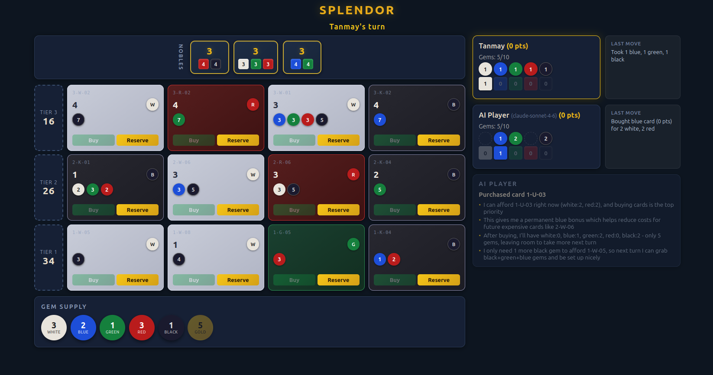
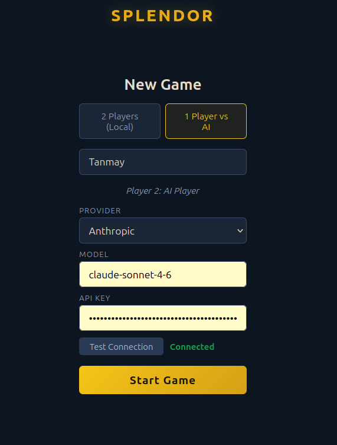
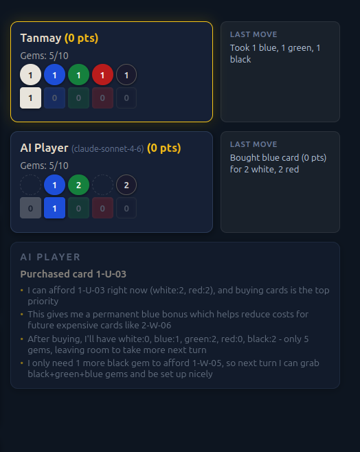
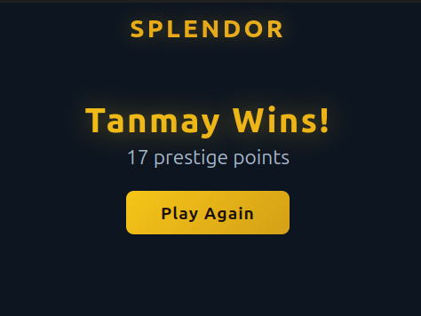

# Splendor

A fully playable browser-based implementation of the Splendor board game. Supports 2-player local mode, 2-player online mode via WebSocket rooms, and 1-player vs AI mode powered by any LLM of your choice.

## Screenshots



| Game Setup | AI Reasoning | Game Over |
|---|---|---|
|  |  |  |

## Features

- **Full Splendor rules** — gem taking, card purchasing, card reserving (visible + blind from deck), noble tile claiming, gold wildcard, gem discard when over 10
- **2-player local mode** — pass-and-play on a single device
- **2-player online mode** — create a room and share a link; real-time play via WebSocket
- **1-player vs AI mode** — plug in any LLM via API key; the AI explains its reasoning after each move
- **Multi-provider AI support** — Anthropic, OpenAI, Google Gemini, OpenRouter, or any OpenAI-compatible custom endpoint
- **Flying animations** — gems and cards animate from source to player panel on every move
- **Dark luxury UI** — gem-colored cards, animated interactions, responsive layout

## Tech Stack

| Layer | Technology |
|---|---|
| UI | React 18 + TypeScript |
| State | Zustand |
| Build | Vite |
| Tests | Vitest (189 tests) |
| Server | Express + Socket.io |

## Getting Started

### Prerequisites

- Node.js 18+

### Install & run

```bash
git clone <repo-url>
cd splendor
npm install
npm run dev
```

This starts both the Vite dev server at `http://localhost:5173` and the AI proxy server at `http://localhost:3001`.

### Playing vs AI

1. Select **1 Player vs AI** on the setup screen
2. Choose your AI provider and enter the model name
3. Paste your API key
4. Click **Test Connection** to verify, then **Start Game**

Supported providers and example model names:

| Provider | Example model |
|---|---|
| Anthropic | `claude-sonnet-4-6` |
| OpenAI | `gpt-4o` |
| Google Gemini | `gemini-2.5-flash` |
| OpenRouter | `anthropic/claude-sonnet-4` |
| Custom (OpenAI-compatible) | any |

> Your API key is never stored — it lives only in browser memory for the duration of the session and is sent exclusively to the local proxy server, which forwards it to the provider.

## Project Structure

```
src/
  game/         # Pure game logic — zero React imports
  ai/           # AI service — prompt builder, API caller, response parser
  store/        # Zustand store — single source of truth
  components/   # React UI components
server/
  index.ts      # Express + Socket.io server — AI proxy, online multiplayer, auth
tests/          # Vitest integration tests
```

## Running Tests

```bash
npm run test
```

189 tests across 8 files covering engine rules, constants validation, store actions, AI service, auth, socket handlers, and room management.

## Rules Reference

Full card data (90 cards, 3 tiers) and noble tile data (10 tiles) are documented in [`rules.md`](rules.md).
